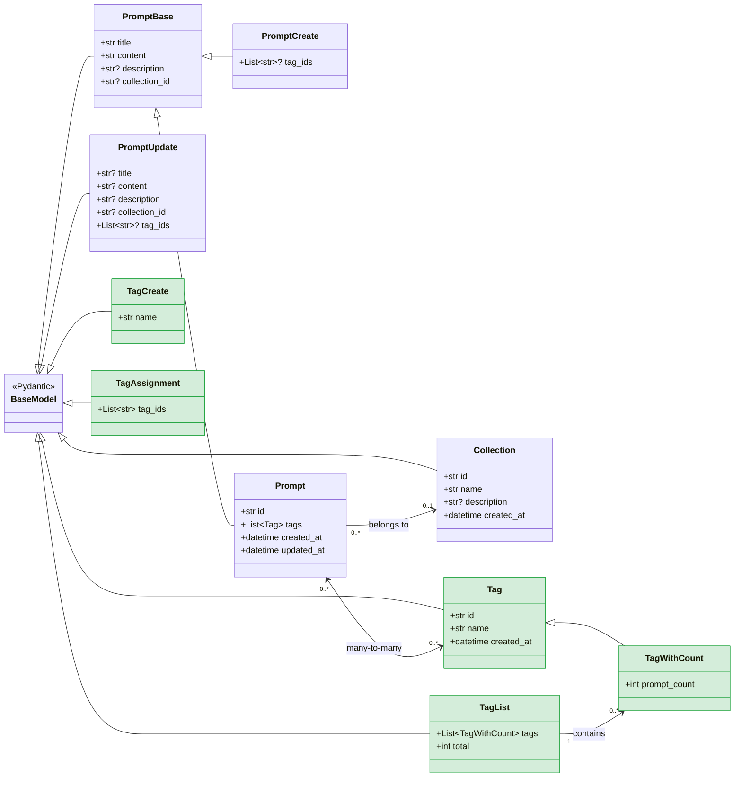
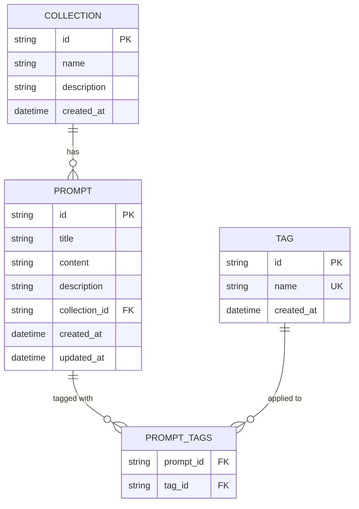
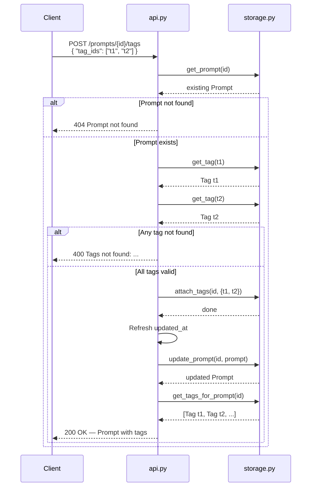
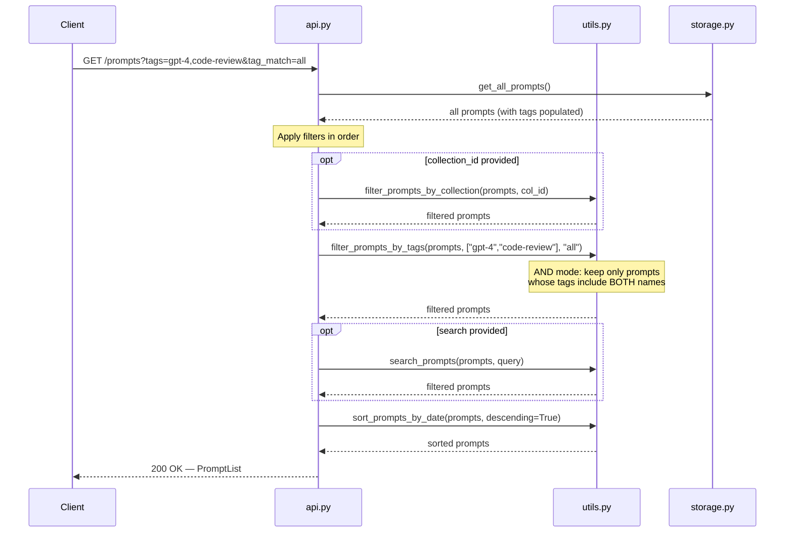

# Feature Spec: Tagging System

> **Status:** Draft
>
> **Author:** PromptLab Engineering
>
> **Last updated:** 2026-02-15

---

## Table of Contents

- [Overview](#overview)
- [Goals and Non-Goals](#goals-and-non-goals)
- [User Stories](#user-stories)
- [Data Model Diagram](#data-model-diagram)
- [Entity Relationship Diagram](#entity-relationship-diagram)
- [Request Flow: Attach Tags to a Prompt](#request-flow-attach-tags-to-a-prompt)
- [Request Flow: Filter Prompts by Tags](#request-flow-filter-prompts-by-tags)
- [Data Model Changes](#data-model-changes)
- [API Endpoint Specifications](#api-endpoint-specifications)
- [Search and Filter Requirements](#search-and-filter-requirements)
- [Edge Cases](#edge-cases)
- [Migration Notes](#migration-notes)

---

## Overview

As the number of prompts in PromptLab grows, engineers need a flexible way to
categorise and discover them beyond the existing collection hierarchy.
Collections act like folders -- a prompt can belong to at most one. Tags are
complementary: they are lightweight, user-defined labels that can be attached
to any prompt in any quantity, enabling cross-cutting categorisation.

**Examples of tags:** `gpt-4`, `code-review`, `summarisation`, `production`,
`experimental`, `few-shot`, `chain-of-thought`.

The **Tagging System** introduces first-class tag resources, a many-to-many
relationship between prompts and tags, and the ability to filter and search
prompts by one or more tags.

---

## Goals and Non-Goals

### Goals

- Allow users to create, list, and delete tags.
- Allow users to attach and detach tags to/from prompts.
- Allow users to filter prompts by one or more tags.
- Integrate tag-based filtering with the existing `search` and `collection_id`
  query parameters on `GET /prompts`.
- Return tags inline on every prompt response so clients can display them
  without extra calls.

### Non-Goals

- Hierarchical or nested tags (e.g. `lang/python`) -- tags are flat strings.
- Tag colours, icons, or other visual metadata (future feature).
- Tagging collections (only prompts are taggable in this iteration).
- Tag-based permissions or visibility rules.
- Auto-tagging or AI-suggested tags (future feature).

---

## User Stories

### US-1: Create a tag

> **As** a prompt engineer,
> **I want** to create a named tag,
> **so that** I can later attach it to prompts for categorisation.

**Acceptance Criteria:**

- [ ] `POST /tags` creates a new tag with a unique `name`.
- [ ] Tag names are normalised to **lowercase** and **trimmed** of leading/
      trailing whitespace before storage.
- [ ] Tag names must be 1--50 characters and may only contain letters, digits,
      hyphens, and underscores (`^[a-z0-9_-]+$` after normalisation).
- [ ] Attempting to create a tag with a name that already exists returns
      `409 Conflict`.
- [ ] The response includes `id`, `name`, and `created_at`.

### US-2: List all tags

> **As** a prompt engineer,
> **I want** to see all available tags,
> **so that** I can pick existing tags when organising my prompts.

**Acceptance Criteria:**

- [ ] `GET /tags` returns all tags sorted alphabetically by `name`.
- [ ] The response includes a `total` count.
- [ ] Each tag includes a `prompt_count` field showing how many prompts
      currently carry that tag.

### US-3: Delete a tag

> **As** a prompt engineer,
> **I want** to delete a tag that is no longer useful,
> **so that** the tag list stays clean and relevant.

**Acceptance Criteria:**

- [ ] `DELETE /tags/{tag_id}` removes the tag.
- [ ] The tag is automatically detached from all prompts that carried it
      (cascading removal of the association, not the prompts themselves).
- [ ] Returns `204 No Content` on success.
- [ ] Returns `404 Not Found` if the tag does not exist.

### US-4: Attach tags to a prompt

> **As** a prompt engineer,
> **I want** to attach one or more tags to a prompt,
> **so that** I can categorise it across multiple dimensions.

**Acceptance Criteria:**

- [ ] `POST /prompts/{prompt_id}/tags` accepts a JSON body with a `tag_ids`
      array.
- [ ] All referenced tags must exist; if any `tag_id` is invalid the entire
      request fails with `400 Bad Request` (atomic operation).
- [ ] Tags that are already attached to the prompt are silently ignored (no
      error, no duplicate).
- [ ] The response is the updated `Prompt` resource with its full `tags` array.
- [ ] The prompt's `updated_at` timestamp is refreshed.

### US-5: Detach tags from a prompt

> **As** a prompt engineer,
> **I want** to remove specific tags from a prompt,
> **so that** I can correct or refine its categorisation.

**Acceptance Criteria:**

- [ ] `DELETE /prompts/{prompt_id}/tags` accepts a JSON body with a `tag_ids`
      array.
- [ ] Tags not currently attached to the prompt are silently ignored.
- [ ] The response is the updated `Prompt` resource with its full `tags` array.
- [ ] The prompt's `updated_at` timestamp is refreshed.
- [ ] Returns `404 Not Found` if the prompt does not exist.

### US-6: View tags on a prompt

> **As** a prompt engineer,
> **I want** to see which tags are attached to a prompt,
> **so that** I understand how it is categorised.

**Acceptance Criteria:**

- [ ] The `Prompt` response model includes a `tags` field (list of `Tag`
      objects).
- [ ] `tags` is included in responses from `GET /prompts`,
      `GET /prompts/{id}`, `POST /prompts`, `PUT /prompts/{id}`, and
      `PATCH /prompts/{id}`.
- [ ] Tags within the list are sorted alphabetically by `name`.

### US-7: Filter prompts by tags

> **As** a prompt engineer,
> **I want** to filter prompts that have specific tags,
> **so that** I can quickly find prompts relevant to my current task.

**Acceptance Criteria:**

- [ ] `GET /prompts` accepts a new `tags` query parameter.
- [ ] The `tags` parameter is a comma-separated list of tag names
      (e.g. `?tags=gpt-4,code-review`).
- [ ] By default, filtering uses **AND** logic -- only prompts that have
      **all** specified tags are returned.
- [ ] An optional `tag_match` query parameter accepts `all` (default) or `any`
      to switch between AND/OR logic.
- [ ] Tag filtering combines with existing `collection_id` and `search`
      parameters (all filters are ANDed together).

### US-8: Set tags during prompt creation or update

> **As** a prompt engineer,
> **I want** to set tags when creating or updating a prompt in a single request,
> **so that** I don't have to make a separate call to tag it.

**Acceptance Criteria:**

- [ ] `PromptCreate` and `PromptUpdate` accept an optional `tag_ids` field
      (list of tag UUIDs).
- [ ] All referenced tags must exist; if any `tag_id` is invalid the request
      fails with `400 Bad Request`.
- [ ] On `POST /prompts`, the provided tags are attached to the new prompt.
- [ ] On `PUT /prompts/{id}`, the provided tags **replace** the current tag
      set entirely.
- [ ] On `PATCH /prompts/{id}`, if `tag_ids` is present it **replaces** the
      current tag set; if absent the tags remain unchanged.

---

## Data Model Diagram

The following class diagram shows the existing models (blue) and the new models
introduced by the tagging system (green). The central relationship is the
**many-to-many** link between `Prompt` and `Tag`, managed through the
`_prompt_tags` lookup in storage.



## Entity Relationship Diagram

A simplified ER diagram showing the storage-level relationships, including the
join structure that powers the many-to-many link.



## Request Flow: Attach Tags to a Prompt



## Request Flow: Filter Prompts by Tags



---

## Data Model Changes

### New model: `Tag`

```python
class Tag(BaseModel):
    """A user-defined label that can be attached to prompts.

    Attributes:
        id: Unique identifier for the tag.
        name: Normalised tag name (lowercase, 1-50 chars, alphanumeric
            plus hyphens and underscores).
        created_at: UTC timestamp of when the tag was created.
    """

    id: str = Field(default_factory=generate_id)
    name: str = Field(
        ...,
        min_length=1,
        max_length=50,
        pattern=r"^[a-z0-9_-]+$",
        description="Normalised tag name (lowercase, alphanumeric, hyphens, underscores).",
    )
    created_at: datetime = Field(default_factory=get_current_time)
```

### New request model: `TagCreate`

```python
class TagCreate(BaseModel):
    """Request body for creating a new tag.

    Attributes:
        name: The desired tag name. Will be normalised to lowercase and
            trimmed before storage.
    """

    name: str = Field(
        ...,
        min_length=1,
        max_length=50,
        description="Tag name (will be normalised to lowercase).",
    )
```

### New response model: `TagWithCount`

```python
class TagWithCount(Tag):
    """Tag resource enriched with usage count for list responses.

    Attributes:
        prompt_count: Number of prompts currently carrying this tag.
    """

    prompt_count: int = Field(
        default=0,
        ge=0,
        description="Number of prompts that currently carry this tag.",
    )
```

### New response model: `TagList`

```python
class TagList(BaseModel):
    """Paginated list of tags.

    Attributes:
        tags: List of tag resources with usage counts.
        total: Total number of tags.
    """

    tags: List[TagWithCount]
    total: int
```

### New request model: `TagAssignment`

```python
class TagAssignment(BaseModel):
    """Request body for attaching or detaching tags.

    Attributes:
        tag_ids: List of tag UUIDs to attach or detach.
    """

    tag_ids: List[str] = Field(
        ...,
        min_length=1,
        description="One or more tag UUIDs.",
    )
```

### Changes to existing `Prompt` model

Add a `tags` field to the full `Prompt` response model:

```python
class Prompt(PromptBase):
    # ... existing fields ...
    tags: List[Tag] = Field(
        default_factory=list,
        description="Tags attached to this prompt, sorted alphabetically.",
    )
```

### Changes to existing `PromptCreate` model

Add an optional `tag_ids` field:

```python
class PromptCreate(PromptBase):
    tag_ids: Optional[List[str]] = Field(
        None,
        description="Optional list of tag UUIDs to attach on creation.",
    )
```

### Changes to existing `PromptUpdate` model

Add an optional `tag_ids` field:

```python
class PromptUpdate(BaseModel):
    # ... existing fields ...
    tag_ids: Optional[List[str]] = Field(
        None,
        description="Replacement tag UUIDs. Omit to leave tags unchanged.",
    )
```

### Storage layer additions

Add two new data structures to the `Storage` class:

```python
self._tags: Dict[str, Tag] = {}
# Key: tag_id, Value: Tag instance

self._prompt_tags: Dict[str, Set[str]] = {}
# Key: prompt_id, Value: set of tag_ids
```

New methods on `Storage`:

| Method | Signature | Description |
|---|---|---|
| `create_tag` | `(tag: Tag) -> Tag` | Store a new tag |
| `get_tag` | `(tag_id: str) -> Optional[Tag]` | Look up a tag by ID |
| `get_tag_by_name` | `(name: str) -> Optional[Tag]` | Look up a tag by normalised name |
| `get_all_tags` | `() -> List[Tag]` | Return all tags |
| `delete_tag` | `(tag_id: str) -> bool` | Remove a tag and all its associations |
| `attach_tags` | `(prompt_id: str, tag_ids: Set[str]) -> None` | Associate tags with a prompt |
| `detach_tags` | `(prompt_id: str, tag_ids: Set[str]) -> None` | Remove tag associations from a prompt |
| `set_tags` | `(prompt_id: str, tag_ids: Set[str]) -> None` | Replace all tags on a prompt |
| `get_tags_for_prompt` | `(prompt_id: str) -> List[Tag]` | Return tags attached to a prompt |
| `get_prompt_count_for_tag` | `(tag_id: str) -> int` | Count prompts carrying a tag |
| `get_prompt_ids_by_tag` | `(tag_id: str) -> Set[str]` | Return prompt IDs carrying a tag |

Updates to existing methods:

| Method | Change |
|---|---|
| `delete_prompt` | Also remove the prompt's entry from `_prompt_tags` |
| `clear` | Also clear `_tags` and `_prompt_tags` |

---

## API Endpoint Specifications

### POST /tags

Create a new tag.

**Request Body:**

```json
{
  "name": "Code-Review"
}
```

> The name will be normalised to `"code-review"` before storage.

**Response:** `201 Created`

```json
{
  "id": "tag-uuid-1",
  "name": "code-review",
  "created_at": "2026-02-15T12:00:00.000000"
}
```

**Errors:**

| Status | Condition |
|---|---|
| 409 | A tag with the same normalised name already exists |
| 422 | Name fails validation (empty, too long, invalid characters after normalisation) |

**Error example -- 409 Conflict:**

```json
{
  "detail": "Tag 'code-review' already exists"
}
```

---

### GET /tags

List all tags with usage counts, sorted alphabetically.

**Response:** `200 OK`

```json
{
  "tags": [
    {
      "id": "tag-uuid-1",
      "name": "code-review",
      "created_at": "2026-02-15T12:00:00.000000",
      "prompt_count": 5
    },
    {
      "id": "tag-uuid-2",
      "name": "gpt-4",
      "created_at": "2026-02-15T12:01:00.000000",
      "prompt_count": 12
    }
  ],
  "total": 2
}
```

---

### DELETE /tags/{tag_id}

Delete a tag and detach it from all prompts.

**Response:** `204 No Content`

**Errors:**

| Status | Condition |
|---|---|
| 404 | Tag not found |

---

### POST /prompts/{prompt_id}/tags

Attach one or more tags to a prompt.

**Request Body:**

```json
{
  "tag_ids": ["tag-uuid-1", "tag-uuid-2"]
}
```

**Response:** `200 OK` -- returns the updated `Prompt` resource.

```json
{
  "id": "prompt-uuid",
  "title": "Code Review Prompt",
  "content": "Review the following code:\n\n{{code}}",
  "description": "A prompt for AI code review",
  "collection_id": null,
  "tags": [
    { "id": "tag-uuid-1", "name": "code-review", "created_at": "..." },
    { "id": "tag-uuid-2", "name": "gpt-4", "created_at": "..." }
  ],
  "created_at": "2026-02-15T12:00:00.000000",
  "updated_at": "2026-02-15T12:05:00.000000"
}
```

**Errors:**

| Status | Condition |
|---|---|
| 400 | One or more `tag_ids` do not exist |
| 404 | Prompt not found |

**Error example -- 400 Bad Request:**

```json
{
  "detail": "Tags not found: tag-uuid-999, tag-uuid-888"
}
```

---

### DELETE /prompts/{prompt_id}/tags

Detach one or more tags from a prompt.

**Request Body:**

```json
{
  "tag_ids": ["tag-uuid-1"]
}
```

**Response:** `200 OK` -- returns the updated `Prompt` resource (same shape as
the attach response, with the removed tags absent from the `tags` array).

**Errors:**

| Status | Condition |
|---|---|
| 404 | Prompt not found |

---

### Changes to existing endpoints

| Endpoint | Change |
|---|---|
| `POST /prompts` | Accept optional `tag_ids` in body. Validate all exist. Attach to new prompt. |
| `PUT /prompts/{id}` | Accept optional `tag_ids`. If present, **replace** all tags on the prompt. |
| `PATCH /prompts/{id}` | Accept optional `tag_ids`. If present, **replace** all tags. If absent, leave unchanged. |
| `DELETE /prompts/{id}` | Also remove prompt from `_prompt_tags`. |
| `GET /prompts` | Accept new `tags` and `tag_match` query params (see below). Include `tags` in each prompt. |
| `GET /prompts/{id}` | Include `tags` in the response. |

---

## Search and Filter Requirements

### Enhanced `GET /prompts` query parameters

| Parameter       | Type   | Default | Description |
|-----------------|--------|---------|-------------|
| `collection_id` | string | --      | Existing: filter by collection UUID |
| `search`        | string | --      | Existing: case-insensitive substring search on title and description |
| `tags`          | string | --      | **New:** comma-separated list of tag names (e.g. `gpt-4,code-review`) |
| `tag_match`     | string | `all`   | **New:** `all` = prompt must have every listed tag (AND); `any` = prompt must have at least one (OR) |

### Filter execution order

1. **Collection filter** -- exclude prompts not in the specified collection.
2. **Tag filter** -- exclude prompts that do not match the tag criteria.
3. **Search filter** -- exclude prompts that do not match the text query.
4. **Sort** -- sort remaining prompts by `created_at` descending.

All filters are combined with AND logic (a prompt must pass every active filter
to appear in results).

### Tag filter implementation

New utility function in `utils.py`:

```python
def filter_prompts_by_tags(
    prompts: List[Prompt],
    tag_names: List[str],
    match: str = "all",
) -> List[Prompt]:
    """Filter prompts by tag names.

    Args:
        prompts: The list of prompts to filter.
        tag_names: Tag names to match against (already normalised to
            lowercase).
        match: "all" requires every tag to be present; "any" requires
            at least one.

    Returns:
        Filtered list of prompts.
    """
```

### Search integration

The existing `search` parameter (title + description substring) does **not**
search tag names. Tag filtering is handled exclusively by the `tags` parameter.

**Rationale:** Mixing free-text search with tag lookups creates ambiguity. Tags
are structured metadata and should be queried explicitly. A future enhancement
could add a `search_tags=true` flag to include tag names in the text search.

### Example queries

```bash
# Prompts tagged with BOTH "gpt-4" AND "code-review"
curl "http://localhost:8000/prompts?tags=gpt-4,code-review"

# Prompts tagged with EITHER "gpt-4" OR "code-review"
curl "http://localhost:8000/prompts?tags=gpt-4,code-review&tag_match=any"

# Combine with collection filter and text search
curl "http://localhost:8000/prompts?collection_id=col-uuid&tags=production&search=summarise"

# All prompts in a collection that have at least one of the listed tags
curl "http://localhost:8000/prompts?collection_id=col-uuid&tags=few-shot,chain-of-thought&tag_match=any"
```

---

## Edge Cases

### E-1: Tag name normalisation and uniqueness

**Scenario:** User creates a tag named `"Code-Review "` (with uppercase and
trailing space).

**Decision:** The name is trimmed and lowercased to `"code-review"` before
validation and storage. If `"code-review"` already exists, return `409`.

**Rationale:** Case-insensitive, whitespace-tolerant uniqueness prevents
near-duplicate tags that would confuse users.

---

### E-2: Invalid characters in tag name

**Scenario:** User creates a tag named `"my tag!"` (contains a space and
punctuation).

**Decision:** After trimming and lowercasing, the name `"my tag!"` fails the
`^[a-z0-9_-]+$` regex and returns `422 Unprocessable Entity`.

**Rationale:** Restricting to URL-safe characters keeps the `?tags=` query
parameter simple and avoids encoding issues.

---

### E-3: Attaching the same tag twice

**Scenario:** User sends `POST /prompts/{id}/tags` with
`{"tag_ids": ["tag-1", "tag-1"]}`.

**Decision:** Deduplicate the list. The tag is attached once. No error is
returned.

**Rationale:** Idempotent operations are easier for clients to reason about.

---

### E-4: Attaching tags that are already on the prompt

**Scenario:** Prompt already has tags A and B. User attaches A and C.

**Decision:** A is silently ignored (already present). C is added. The prompt
now has A, B, and C.

**Rationale:** Additive semantics make the attach endpoint safe to retry.

---

### E-5: Detaching tags that are not on the prompt

**Scenario:** Prompt has tags A and B. User detaches B and C.

**Decision:** B is removed. C is silently ignored (was not present). The prompt
now has only A.

**Rationale:** Idempotent deletes prevent errors from race conditions or stale
client state.

---

### E-6: Deleting a tag that is attached to prompts

**Scenario:** Tag `"gpt-4"` is attached to 20 prompts. User deletes the tag.

**Decision:** The tag is removed from all 20 prompts and then deleted. The
prompts themselves are **not** deleted or modified beyond losing the tag
association. Their `updated_at` is **not** changed (the tag was removed
system-wide, not by an explicit prompt update).

**Rationale:** Cascading the tag deletion is safer than leaving orphaned tag
references. Not touching `updated_at` avoids flooding change feeds.

---

### E-7: Creating a prompt with non-existent tag IDs

**Scenario:** `POST /prompts` includes `"tag_ids": ["valid-uuid", "bad-uuid"]`.

**Decision:** The entire request fails with `400 Bad Request`. No prompt is
created. The error message lists the invalid IDs.

**Rationale:** Atomic validation prevents prompts from being created in an
inconsistent state.

---

### E-8: Filtering by a tag name that does not exist

**Scenario:** `GET /prompts?tags=nonexistent-tag`.

**Decision:** Return an empty list with `total: 0`. No error is raised.

**Rationale:** A filter that matches nothing is a valid result, not an error.
This is consistent with `collection_id` filtering behaviour.

---

### E-9: Empty `tags` query parameter

**Scenario:** `GET /prompts?tags=` (empty string).

**Decision:** Ignore the parameter entirely and return all prompts (as if
`tags` were not provided).

**Rationale:** Graceful handling of empty filters avoids confusing 400 errors
for minor client-side issues.

---

### E-10: Very large number of tags on a single prompt

**Scenario:** A prompt has 100+ tags attached.

**Decision:** No hard limit is enforced in this iteration. All tags are
returned inline.

**Future consideration:** Add a configurable maximum (e.g. 50 tags per prompt)
and return `400` if exceeded.

---

### E-11: Tag names used in `?tags=` parameter vs tag IDs

**Scenario:** Should the `tags` query parameter accept IDs or names?

**Decision:** Tag **names** are used in the query parameter (`?tags=gpt-4`),
while tag **IDs** are used in request bodies (`"tag_ids": ["uuid"]`).

**Rationale:** Names are human-readable and natural for URL query strings. IDs
are unambiguous for mutation operations.

---

## Migration Notes

### In-memory storage

Add `_tags: Dict[str, Tag]` and `_prompt_tags: Dict[str, Set[str]]` to the
`Storage` class. No data migration needed -- existing prompts will have an
empty `tags` list by default.

### Future database migration

When moving to a persistent database, use a join table:

```sql
CREATE TABLE tags (
    id         TEXT PRIMARY KEY,
    name       TEXT NOT NULL UNIQUE,
    created_at TIMESTAMP NOT NULL DEFAULT CURRENT_TIMESTAMP
);

CREATE TABLE prompt_tags (
    prompt_id TEXT NOT NULL REFERENCES prompts(id) ON DELETE CASCADE,
    tag_id    TEXT NOT NULL REFERENCES tags(id) ON DELETE CASCADE,
    PRIMARY KEY (prompt_id, tag_id)
);

CREATE INDEX idx_prompt_tags_tag_id ON prompt_tags(tag_id);
```

### Backward compatibility

- The new `tags` field on `Prompt` defaults to an empty list, so existing
  clients that do not read or send tags are unaffected.
- The new `tag_ids` field on `PromptCreate` and `PromptUpdate` is optional and
  ignored by existing clients.
- The new `tags` and `tag_match` query parameters on `GET /prompts` are
  optional; omitting them preserves current behaviour.
- No existing endpoint signatures or response shapes are broken.
