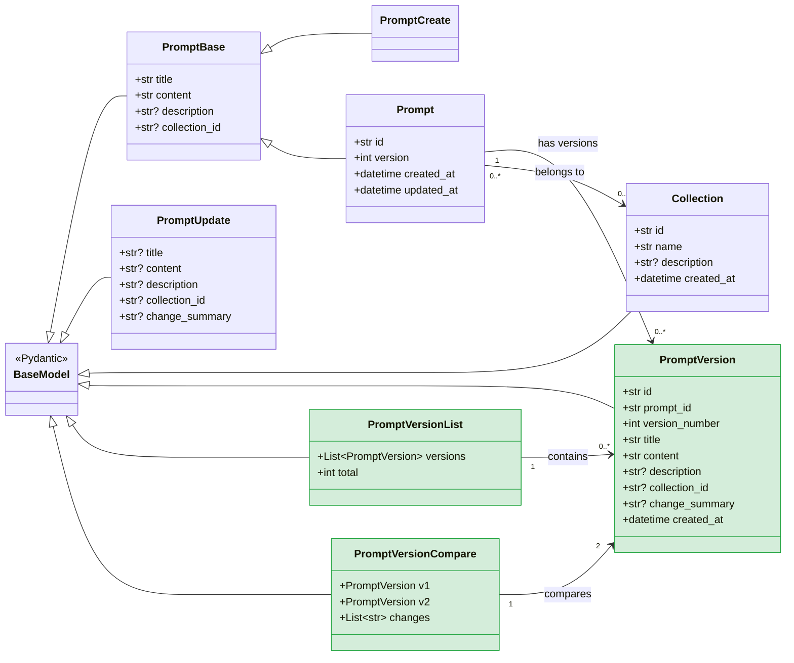
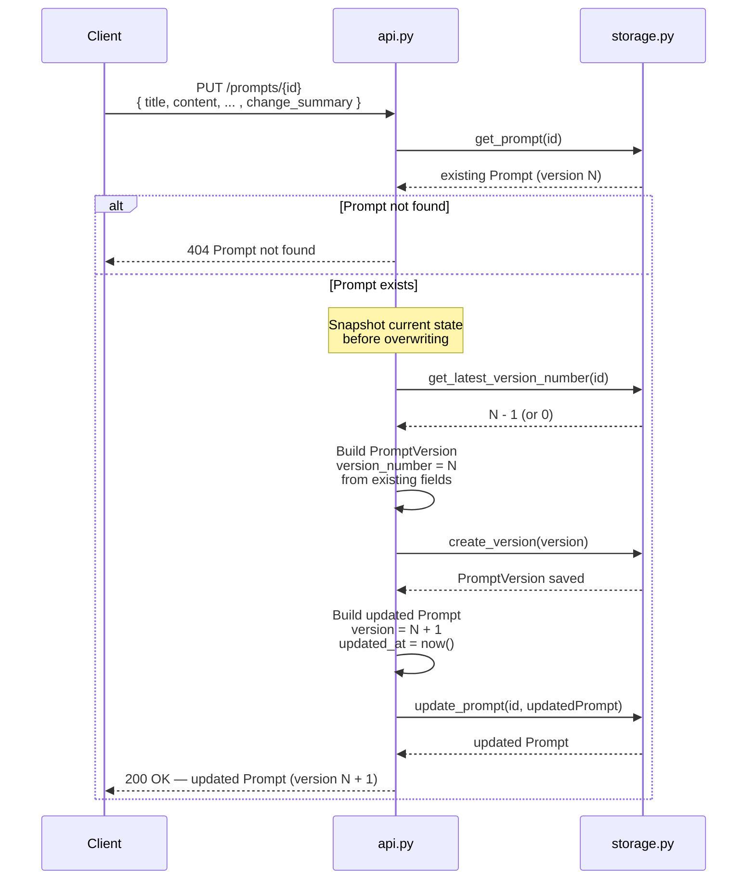
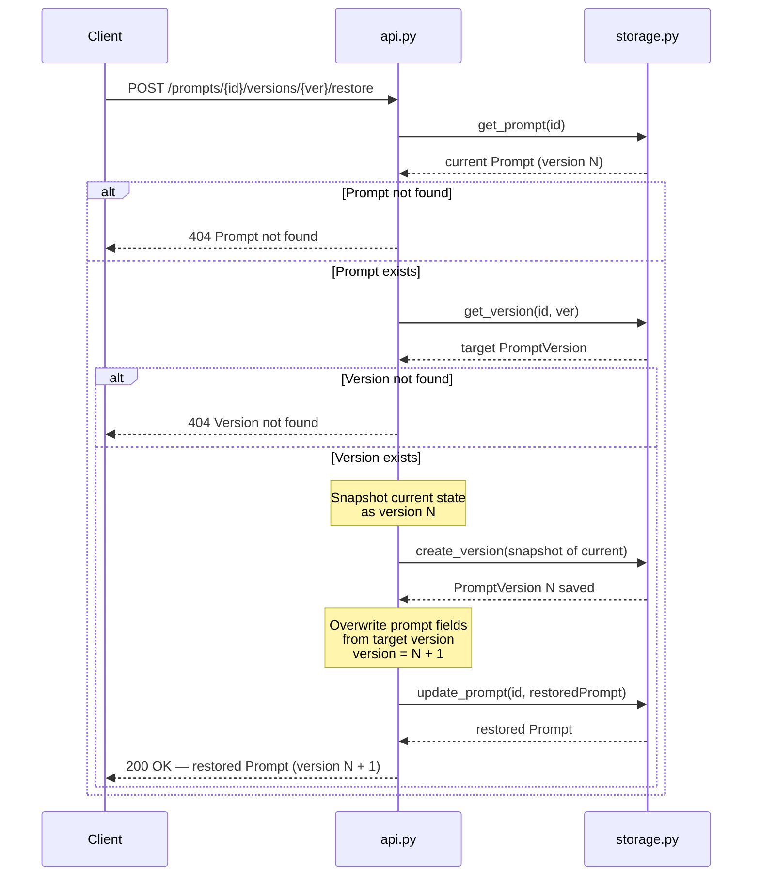

# Feature Spec: Prompt Version Tracking

> **Status:** Draft
>
> **Author:** PromptLab Engineering
>
> **Last updated:** 2026-02-15

---

## Table of Contents

- [Overview](#overview)
- [Goals and Non-Goals](#goals-and-non-goals)
- [User Stories](#user-stories)
- [Data Model Diagram](#data-model-diagram)
- [Request Flow: Update with Versioning](#request-flow-update-with-versioning)
- [Request Flow: Restore a Version](#request-flow-restore-a-version)
- [Data Model Changes](#data-model-changes)
- [API Endpoint Specifications](#api-endpoint-specifications)
- [Edge Cases](#edge-cases)
- [Migration Notes](#migration-notes)

---

## Overview

Prompt engineering is an iterative process. Engineers frequently revise a
prompt's content, test different phrasings, and sometimes need to revert to an
earlier version that performed better. Today, PromptLab overwrites the prompt
in place on every PUT or PATCH -- there is no way to see what changed, when it
changed, or to roll back.

**Prompt Version Tracking** introduces an automatic, immutable version history
for every prompt. Each time a prompt is updated, a snapshot of its previous
state is saved as a numbered version. Users can list the full history, view any
past version, compare two versions, and restore a previous version as the
current one.

---

## Goals and Non-Goals

### Goals

- Automatically create a version record on every prompt update (PUT/PATCH).
- Allow users to list, view, and compare past versions.
- Allow users to restore any past version as the current prompt.
- Preserve full backward compatibility with existing prompt endpoints.

### Non-Goals

- Branching or forking of prompts (out of scope).
- Rich diff rendering (clients can compute diffs from the raw content).
- Version tracking for collections (future feature).
- Configurable retention policies or version limits (future feature).

---

## User Stories

### US-1: Automatic version creation on update

> **As** a prompt engineer,
> **I want** a new version to be saved automatically every time I update a prompt,
> **so that** I never lose previous iterations of my work.

**Acceptance Criteria:**

- [ ] When a prompt is updated via `PUT /prompts/{id}`, a version record is
      created containing the prompt's state **before** the update.
- [ ] When a prompt is updated via `PATCH /prompts/{id}`, a version record is
      created containing the prompt's state **before** the update.
- [ ] The version record stores `title`, `content`, `description`,
      `collection_id`, and a `change_summary` (optional, user-provided).
- [ ] Each version is assigned a sequential `version_number` starting at 1.
- [ ] The prompt's `version` field on the main resource reflects the current
      (latest) version number.
- [ ] Creating a prompt (`POST /prompts`) sets `version` to 1 but does **not**
      create a version history record (there is nothing to snapshot yet).

### US-2: List version history

> **As** a prompt engineer,
> **I want** to see the full version history of a prompt,
> **so that** I can review how it evolved over time.

**Acceptance Criteria:**

- [ ] `GET /prompts/{id}/versions` returns a list of all version records.
- [ ] Versions are sorted by `version_number` descending (newest first).
- [ ] Each version in the list includes `version_number`, `created_at`,
      `change_summary`, `title`, and `content`.
- [ ] The response includes a `total` count.
- [ ] Returns 404 if the prompt does not exist.

### US-3: View a specific version

> **As** a prompt engineer,
> **I want** to view the full details of any past version,
> **so that** I can inspect exactly what a prompt looked like at that point.

**Acceptance Criteria:**

- [ ] `GET /prompts/{id}/versions/{version_number}` returns the full version
      record.
- [ ] Returns 404 if the prompt or version number does not exist.

### US-4: Compare two versions

> **As** a prompt engineer,
> **I want** to compare any two versions of a prompt side by side,
> **so that** I can understand what changed between iterations.

**Acceptance Criteria:**

- [ ] `GET /prompts/{id}/versions/compare?v1=X&v2=Y` returns both version
      records in a single response.
- [ ] The response includes a `changes` object listing which fields differ.
- [ ] Returns 404 if the prompt does not exist.
- [ ] Returns 400 if either version number is invalid or does not exist.
- [ ] Returns 400 if `v1` equals `v2`.

### US-5: Restore a previous version

> **As** a prompt engineer,
> **I want** to restore a previous version so it becomes the current prompt,
> **so that** I can revert a change that made the prompt worse.

**Acceptance Criteria:**

- [ ] `POST /prompts/{id}/versions/{version_number}/restore` updates the
      prompt's content to match the specified version.
- [ ] A new version record is created to capture the state **before** the
      restore (so the restore itself is tracked in history).
- [ ] The prompt's `version` field is incremented (restore is treated as a new
      version, not a rewind).
- [ ] The restored prompt's `updated_at` is set to the current time.
- [ ] Returns 404 if the prompt or version number does not exist.

---

## Data Model Diagram

The following class diagram shows the existing models (blue) and the new models
introduced by this feature (green), along with their relationships.



## Request Flow: Update with Versioning

This sequence diagram shows what happens when a client sends a PUT or PATCH
request to update a prompt.



## Request Flow: Restore a Version

This sequence diagram shows the restore process, which itself creates a new
version to preserve the audit trail.



---

## Data Model Changes

### New model: `PromptVersion`

A version is an immutable snapshot of a prompt's mutable fields at a point in
time.

```python
class PromptVersion(BaseModel):
    """Immutable snapshot of a prompt at a specific version.

    Attributes:
        id: Unique identifier for this version record.
        prompt_id: UUID of the parent prompt.
        version_number: Sequential version number (1, 2, 3, ...).
        title: The prompt title at this version.
        content: The prompt content at this version.
        description: The prompt description at this version.
        collection_id: The collection reference at this version.
        change_summary: Optional user-provided note about what changed.
        created_at: UTC timestamp of when this version was created.
    """

    id: str = Field(default_factory=generate_id)
    prompt_id: str = Field(..., description="UUID of the parent prompt.")
    version_number: int = Field(..., ge=1, description="Sequential version number.")
    title: str = Field(..., description="Prompt title at this version.")
    content: str = Field(..., description="Prompt content at this version.")
    description: Optional[str] = Field(None, description="Prompt description at this version.")
    collection_id: Optional[str] = Field(None, description="Collection reference at this version.")
    change_summary: Optional[str] = Field(
        None,
        max_length=500,
        description="Optional note describing what changed in this version.",
    )
    created_at: datetime = Field(default_factory=get_current_time)
```

### New response model: `PromptVersionList`

```python
class PromptVersionList(BaseModel):
    """Paginated list of prompt versions.

    Attributes:
        versions: List of version records.
        total: Total number of versions.
    """

    versions: List[PromptVersion]
    total: int
```

### New response model: `PromptVersionCompare`

```python
class PromptVersionCompare(BaseModel):
    """Side-by-side comparison of two prompt versions.

    Attributes:
        v1: The first version record.
        v2: The second version record.
        changes: List of field names that differ between the two versions.
    """

    v1: PromptVersion
    v2: PromptVersion
    changes: List[str] = Field(
        ...,
        description="Field names that differ between v1 and v2.",
    )
```

### Changes to existing `Prompt` model

Add one new field to the existing `Prompt` class:

```python
class Prompt(PromptBase):
    # ... existing fields ...
    version: int = Field(
        default=1,
        ge=1,
        description="Current version number of the prompt.",
    )
```

### Changes to existing `PromptUpdate` model

Add an optional field so callers can annotate their changes:

```python
class PromptUpdate(BaseModel):
    # ... existing fields ...
    change_summary: Optional[str] = Field(
        None,
        max_length=500,
        description="Optional note describing what changed.",
    )
```

> **Note:** `change_summary` is excluded from the prompt itself and only stored
> on the `PromptVersion` record.

### Storage layer additions

Add a third dictionary to the `Storage` class:

```python
self._versions: Dict[str, List[PromptVersion]] = {}
# Key: prompt_id, Value: list of PromptVersion sorted by version_number
```

New methods on `Storage`:

| Method | Signature | Description |
|---|---|---|
| `create_version` | `(version: PromptVersion) -> PromptVersion` | Append a version to a prompt's history |
| `get_versions` | `(prompt_id: str) -> List[PromptVersion]` | Return all versions for a prompt |
| `get_version` | `(prompt_id: str, version_number: int) -> Optional[PromptVersion]` | Return a specific version |
| `get_latest_version_number` | `(prompt_id: str) -> int` | Return the highest version number, or 0 if none |
| `delete_versions` | `(prompt_id: str) -> bool` | Remove all versions for a prompt (called on prompt delete) |

---

## API Endpoint Specifications

### GET /prompts/{prompt_id}/versions

List all versions for a prompt, newest first.

**Response:** `200 OK`

```json
{
  "versions": [
    {
      "id": "ver-uuid-2",
      "prompt_id": "prompt-uuid",
      "version_number": 2,
      "title": "Code Review v2",
      "content": "Review this PR:\n\n{{diff}}",
      "description": "Updated for PR reviews",
      "collection_id": "col-uuid",
      "change_summary": "Switched from code to diff variable",
      "created_at": "2026-02-15T13:00:00.000000"
    },
    {
      "id": "ver-uuid-1",
      "prompt_id": "prompt-uuid",
      "version_number": 1,
      "title": "Code Review v1",
      "content": "Review this code:\n\n{{code}}",
      "description": "Original version",
      "collection_id": "col-uuid",
      "change_summary": null,
      "created_at": "2026-02-15T12:00:00.000000"
    }
  ],
  "total": 2
}
```

**Errors:**

| Status | Condition |
|---|---|
| 404 | Prompt not found |

---

### GET /prompts/{prompt_id}/versions/{version_number}

Retrieve a single version by its number.

**Response:** `200 OK`

```json
{
  "id": "ver-uuid-1",
  "prompt_id": "prompt-uuid",
  "version_number": 1,
  "title": "Code Review v1",
  "content": "Review this code:\n\n{{code}}",
  "description": "Original version",
  "collection_id": "col-uuid",
  "change_summary": null,
  "created_at": "2026-02-15T12:00:00.000000"
}
```

**Errors:**

| Status | Condition |
|---|---|
| 404 | Prompt not found or version number does not exist |

---

### GET /prompts/{prompt_id}/versions/compare?v1={int}&v2={int}

Compare two versions side by side.

**Query Parameters:**

| Parameter | Type | Required | Description |
|---|---|---|---|
| `v1` | int | Yes | First version number |
| `v2` | int | Yes | Second version number |

**Response:** `200 OK`

```json
{
  "v1": {
    "id": "ver-uuid-1",
    "prompt_id": "prompt-uuid",
    "version_number": 1,
    "title": "Code Review v1",
    "content": "Review this code:\n\n{{code}}",
    "description": "Original version",
    "collection_id": "col-uuid",
    "change_summary": null,
    "created_at": "2026-02-15T12:00:00.000000"
  },
  "v2": {
    "id": "ver-uuid-2",
    "prompt_id": "prompt-uuid",
    "version_number": 2,
    "title": "Code Review v2",
    "content": "Review this PR:\n\n{{diff}}",
    "description": "Updated for PR reviews",
    "collection_id": "col-uuid",
    "change_summary": "Switched from code to diff variable",
    "created_at": "2026-02-15T13:00:00.000000"
  },
  "changes": ["title", "content", "description"]
}
```

**Errors:**

| Status | Condition |
|---|---|
| 400 | `v1` or `v2` is missing, invalid, or does not exist |
| 400 | `v1` equals `v2` |
| 404 | Prompt not found |

---

### POST /prompts/{prompt_id}/versions/{version_number}/restore

Restore a previous version as the current prompt state.

**Request Body:** None required. Optionally accepts:

```json
{
  "change_summary": "Reverting to version 1 after regression"
}
```

**Response:** `200 OK` -- Returns the updated `Prompt` resource.

```json
{
  "id": "prompt-uuid",
  "title": "Code Review v1",
  "content": "Review this code:\n\n{{code}}",
  "description": "Original version",
  "collection_id": "col-uuid",
  "version": 4,
  "created_at": "2026-02-15T12:00:00.000000",
  "updated_at": "2026-02-15T15:30:00.000000"
}
```

**Errors:**

| Status | Condition |
|---|---|
| 404 | Prompt not found or version number does not exist |

---

### Changes to existing endpoints

| Endpoint | Change |
|---|---|
| `POST /prompts` | Set `version = 1` on the new prompt. No version record created. |
| `PUT /prompts/{id}` | Before overwriting, snapshot the current state as a new `PromptVersion`. Increment `version`. Accept optional `change_summary` in body. |
| `PATCH /prompts/{id}` | Same as PUT -- snapshot before applying changes. |
| `DELETE /prompts/{id}` | Also delete all associated version records. |
| `GET /prompts/{id}` | Response now includes the `version` field. |
| `GET /prompts` | Each prompt in the list now includes the `version` field. |

---

## Edge Cases

### E-1: Update with no actual changes

**Scenario:** A PUT or PATCH is sent with values identical to the current
prompt.

**Decision:** A version record is **still** created. Determining deep equality
across all fields adds complexity and may surprise users who expect every save
to be tracked. The `change_summary` can indicate "no changes" if the client
chooses.

**Rationale:** Simplicity and predictability. Users can filter or ignore
no-change versions in the UI.

---

### E-2: Restoring the current version

**Scenario:** User calls `POST /prompts/{id}/versions/3/restore` when the
prompt is already at version 3.

**Decision:** This is allowed. A new version record (version 4) is created that
is a snapshot of version 3's state. The prompt's `version` becomes 4.

**Rationale:** Consistent behaviour -- restore always creates a new version.
This avoids special-case logic and keeps the audit trail complete.

---

### E-3: Rapid successive updates

**Scenario:** Multiple updates arrive in quick succession (e.g. auto-save).

**Decision:** Each update produces a version record regardless of timing. No
debouncing or deduplication is performed server-side.

**Rationale:** The server should be a reliable recorder. Rate limiting or
batching is the client's responsibility.

---

### E-4: Deleting a prompt with version history

**Scenario:** A prompt with 50 versions is deleted.

**Decision:** All version records are deleted along with the prompt. This is a
hard delete -- there is no soft-delete or trash mechanism.

**Rationale:** Consistent with the current cascading delete pattern (e.g.
deleting a collection removes its prompts).

---

### E-5: Version numbering after restore

**Scenario:** Prompt is at version 5. User restores version 2. What is the new
version number?

**Decision:** The new version number is 6. Version numbers are strictly
monotonically increasing and are never reused or rewound.

**Rationale:** Prevents ambiguity. "Version 6" always means the sixth change
that was made, regardless of whether it was a forward edit or a restore.

---

### E-6: Concurrent updates

**Scenario:** Two clients update the same prompt at the same time.

**Decision:** Last-write-wins, same as the current API behaviour. Both updates
produce version records. No optimistic locking is implemented in this iteration.

**Future consideration:** Add an `If-Match` header with the current `version`
number for optimistic concurrency control.

---

### E-7: Large version histories

**Scenario:** A prompt accumulates hundreds or thousands of versions.

**Decision:** No limit is enforced in this iteration. The
`GET /prompts/{id}/versions` endpoint returns all versions.

**Future consideration:** Add pagination (`?offset=0&limit=50`) and/or a
retention policy that auto-prunes versions older than N days.

---

### E-8: Version history for newly created prompts

**Scenario:** User calls `GET /prompts/{id}/versions` on a prompt that was just
created and never updated.

**Decision:** Return an empty list with `total: 0`. Version records are only
created on updates, not on initial creation.

**Rationale:** The initial creation state is always available via the prompt
itself (it is version 1). There is no "before" state to snapshot.

---

## Migration Notes

### In-memory storage

Add `_versions: Dict[str, List[PromptVersion]]` to the `Storage` class. No
data migration is needed -- existing prompts will have `version = 1` by default
and an empty version history.

### Future database migration

When moving to a persistent database, the `prompt_versions` table should be
created with the following schema:

```sql
CREATE TABLE prompt_versions (
    id            TEXT PRIMARY KEY,
    prompt_id     TEXT NOT NULL REFERENCES prompts(id) ON DELETE CASCADE,
    version_number INTEGER NOT NULL,
    title         TEXT NOT NULL,
    content       TEXT NOT NULL,
    description   TEXT,
    collection_id TEXT,
    change_summary TEXT,
    created_at    TIMESTAMP NOT NULL DEFAULT CURRENT_TIMESTAMP,
    UNIQUE (prompt_id, version_number)
);

CREATE INDEX idx_versions_prompt_id ON prompt_versions(prompt_id);
```

### Backward compatibility

- The new `version` field on `Prompt` defaults to `1`, so existing clients that
  do not send or read this field are unaffected.
- All existing endpoints retain their current behaviour. Version tracking is
  additive -- no breaking changes are introduced.
- The `change_summary` field on `PromptUpdate` is optional and ignored by
  existing clients.
